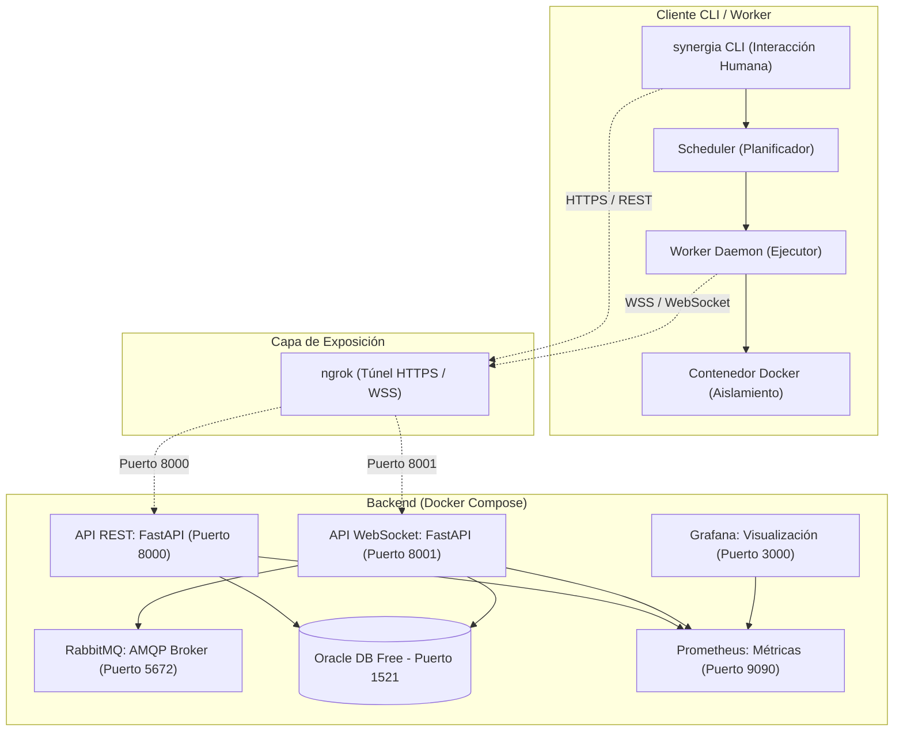

La arquitectura de **Synergia** está basada en un sistema centralizado para el control de negocio, transacciones e inventario, complementado con un modelo de distribución de carga asíncrono y desacoplado mediante un broker de mensajería y conexiones bidireccionales persistentes. 

El sistema separa estrictamente las operaciones transaccionales puntuales del flujo continuo de distribución de datos a gran escala.

---

## Diagrama de Arquitectura General

El siguiente esquema representa los servicios en tiempo de ejecución, sus puertos de comunicación, protocolos y flujos de datos entre el lado cliente y el lado servidor:

---

## Servicios en Tiempo de Ejecución

| Servicio | Tecnología | Puerto | Responsabilidad / Descripción |
| :--- | :--- | :--- | :--- |
| **API REST** | FastAPI + Uvicorn (`api.py`) | `8000` | Gestión de cuentas, autenticación, control de tareas, procesos, ejecuciones, pagos, descargas de resultados y exposición de métricas Prometheus. |
| **API WebSocket** | FastAPI + aio-pika (`ws_api.py`) | `8001` | Asignación en tiempo real de bloques (chunks) de trabajo y control del ciclo de vida de la conexión del worker. |
| **Cola de Mensajes** | RabbitMQ | `5672` / `15672` | Buffer persistente y asíncrono. Mantiene colas dedicadas por tarea para desacoplar la oferta de trabajo de su demanda. |
| **Base de Datos** | Oracle Database Free | `1521` | Motor relacional completo. Almacena las tablas de negocio, relaciones circulares de ejecución y el ledger criptográfico inmutable. |
| **Monitorización** | Prometheus | `9090` | Recolección periódica de métricas operacionales e indicadores de negocio desde los endpoints `/metrics`. |
| **Visualización** | Grafana | `3000` | Exposición del cuadro de mando operativo (`synergia_dashboard.json`) para la toma de decisiones de infraestructura. |
| **Túnel de Red** | ngrok | `4040` | Exposición segura de las APIs locales a la red pública (HTTPS/WSS) para pruebas en entornos de desarrollo sin IP pública fija. |

---

## 1. Decisiones de Diseño del Servidor

### 1.1 API REST (FastAPI)
La API REST es el núcleo lógico del sistema. Se optó por una arquitectura REST por su estructura de recursos jerárquicos natural (por ejemplo, `/task/{id}/process/{pid}/execution/{eid}/result`) y su interoperabilidad universal.

La API implementa **18 requerimientos funcionales críticos (FU-01 a FU-18)**:

* **FU-01 Registro de usuarios:** Creación de cuentas con email, usuario y contraseña. Genera un email de confirmación firmado con un JWT específico de un solo uso (24 horas) vía SMTP.
* **FU-02 Autenticación local:** Login mediante usuario o email y contraseña, verificando las credenciales contra hashes **Argon2** y devolviendo un JWT firmado con HS256.
* **FU-03 Autenticación mediante OAuth2.0:** Inicio de sesión y registro automático utilizando proveedores externos (Google y GitHub) a través del flujo *Authorization Code Flow*. Permite asociar múltiples proveedores a una única cuenta de forma concurrente.
* **FU-04 Consultar información de cuenta:** Consulta pública de reputación, balance de créditos e historial criptográficamente enlazado de transacciones.
* **FU-05 Publicación de tareas:** Creación de una tarea apuntando a un repositorio público de GitHub y su snapshot hash correspondiente. El sistema interpreta el `config.toml` remoto para inicializar la estructura.
* **FU-06 Adición de entradas en tareas dinámicas:** Permite al publicador inyectar nuevos bloques de trabajo en caliente (`POST /task/{id}/input`) a una tarea activa de tipo dinámico, rellenando directamente la cola RabbitMQ.
* **FU-07 Consulta de tareas:** Listado y filtrado de tareas. Permite segmentar por tareas creadas por el usuario o tareas en las que participa como worker (suscritas).
* **FU-08 Consulta de progreso:** Devuelve la relación en tiempo real entre ítems completados, verificados y pendientes para una tarea concreta.
* **FU-09 Sincronización de tarea:** Permite al publicador actualizar la referencia del commit e integridad del repositorio (hash SHA-256) tras realizar cambios legítimos en el código fuente de la tarea.
* **FU-10 Gestión del estado:** Modificación del estado de una tarea (`ACTIVE`, `PAUSED`, `CANCELLED`). La cancelación o finalización vacía e inválida las colas correspondientes en RabbitMQ. No es posible reactivar una tarea sin saldo.
* **FU-11 Creación de proceso:** El worker declara el inicio de procesamiento de un chunk específico. Valida de antemano que el rango de ítems no se solape con procesos ya existentes y que el hash de integridad local del worker coincida exactamente con el de la tarea.
* **FU-12 Consulta de procesos:** Búsqueda e inspección de procesos asociados a una tarea, permitiendo localizar el bloque exacto que contiene un índice de entrada.
* **FU-13 Creación de ejecución de verificación:** Permite a un nodo worker registrar su intención de actuar como validador cruzado determinista para un proceso procesado por otro nodo.
* **FU-14 Consulta de ejecuciones:** Inspección de los intentos de ejecución individuales para un proceso, identificando el estado (éxito, fallo, cancelado, pendiente) de cada uno.
* **FU-15 Subida de resultados:** El worker envía el fichero binario resultante mediante `multipart/form-data` junto con las telemetrías de consumo de recursos. Los ficheros se almacenan en el sistema mediante un algoritmo de *sharding por hash SHA-256* para deduplicación automática de almacenamiento físico.
* **FU-16 Obtención de proceso pendiente de verificación:** Proporciona de forma prioritaria a un worker el ID del proceso que le toca verificar a continuación basándose en heurísticas de sospecha (reputación y desviación de costes).
* **FU-17 Descarga de resultados:** Descarga en streaming de un ZIP empaquetado de forma dinámica con todos los resultados válidos (filtrable por `?canonical_only=true`).
* **FU-18 Exposición de métricas:** Endpoint expuesto en `/metrics` en formato nativo Prometheus para series temporales de la infraestructura.

### 1.2 API WebSocket (FastAPI)
La API WebSocket resuelve el consumo continuo de datos. Se diseñó una API de comunicación bidireccional por socket por tres motivos críticos:
1. **Evitar la exposición directa de RabbitMQ:** Los nodos clientes no hablan directamente con el broker. De este modo, no se requiere la compleja gestión de credenciales RabbitMQ individuales por usuario y se elimina una potencial superficie de ataque.
2. **Control de conectividad (Heartbeat nativo):** El protocolo WebSocket realiza pings y pongs automáticos. Si el cliente sufre una desconexión o caída física abrupta, la API WebSocket lo detecta al instante, revoca los procesos huérfanos e introduce un **NACK (Negative Acknowledgement)** en RabbitMQ para reencolar el trabajo en vuelo sin pérdida de datos.
3. **Control de Flujo de Trabajo (Backpressure):** Permite al worker ajustar su capacidad de consumo mediante el flag `n_consumes`.

### 1.3 RabbitMQ (AMQP)
RabbitMQ actúa como el buffer asíncrono que desacopla la publicación del consumo de trabajo. Se utiliza un exchange de tipo **Direct** (con routing key `task_{id}`) y colas declaradas como **Durable** para asegurar la resiliencia frente a caídas del broker.

#### ¿Por qué no usar Apache Kafka?
Kafka está optimizado para procesar flujos masivos de eventos (logs) de forma estrictamente secuencial mediante almacenamiento prolongado. Synergia requiere un **control fino por mensaje individual**: confirmación (*acknowledgement*) selectiva, reencolado por fallo de worker y consumo dinámico no lineal. RabbitMQ se adapta nativamente a este patrón de colas de trabajo (*competing consumers*).

#### ¿Por qué no usar Redis?
Redis prioriza el acceso en memoria de ultra-baja latencia y carece de confirmaciones fiables integradas por mensaje con persistencia transaccional nativa, obligando a escribir scripts en Lua complejos para emular colas robustas.

### 1.4 Base de Datos (Oracle Database Free)
La base de datos relacional garantiza la consistencia global del sistema.

#### Nivel de aislamiento SERIALIZABLE
Se configuró el pool de conexiones al nivel de aislamiento de transacciones más estricto: **SERIALIZABLE**. 
En un entorno concurrente, el cambio del resultado canónico de un proceso implica revertir el saldo de créditos al worker antiguo y transferir créditos al nuevo worker de forma paralela. Un nivel de aislamiento inferior (como *Read Committed*) permitiría a dos transacciones concurrentes leer el mismo estado e incurrir en condiciones de carrera (doble pago o desbalanceo financiero de créditos de la red). `SERIALIZABLE` evita lecturas sucias, fantasma o no repetibles forzando la consistencia matemática absoluta de la economía interna de la plataforma.

#### Blockchain Tables de Oracle
Se migró el motor de datos a Oracle Database para aprovechar de forma nativa sus **Blockchain Tables**. Estas tablas son libros contables inmutables donde cada fila contiene un hash criptográfico enlazado con la fila anterior mediante **SHA2-512** (ver sección de [Modelo de Datos](/docs/modelo-de-datos)). Esto protege el historial transaccional de créditos frente a manipulaciones internas (incluso de usuarios administradores con acceso a la base de datos).

---

## 2. Decisiones de Diseño del Cliente

El cliente CLI (`synergia-client`) está diseñado como un paquete Python empaquetado y modular de fácil distribución, que actúa bajo dos roles:

### 2.1 CLI de Usuario
* Centraliza las interacciones humanas: login, creación de tareas, inyección de inputs dinámicos y descargas.
* Almacena las sesiones activas de forma local en `~/.cn_profile.json` (JWT) y la configuración física en `~/.cn_device.json`.
* **Publicación libre de ejecución:** El publicador puede compilar y publicar una tarea calculando sus hashes locales de integridad sin necesidad de tener recursos físicos pesados (p. ej. GPU) para ejecutarla.

### 2.2 Scheduler (Planificador)
El planificador (`start-scheduler`) automatiza la suscripción a múltiples colas y ofrece dos modos de operación avanzados para coordinar el hardware:

* **Modo Round-Robin (Por Turnos):** El nodo se conecta a una cola, procesa un bloque de `N` chunks (por defecto 5), confirma el trabajo, rota a la siguiente tarea suscrita y repite el proceso secuencialmente. Esto evita la inanición de tareas pequeñas en nodos con un único worker.
* **Modo Split (División de Núcleos):** El scheduler lee los núcleos totales disponibles en `~/.cn_device.json`, divide los hilos equitativamente entre todas las tareas activas suscritas y levanta procesos worker independientes que consumen y ejecutan en paralelo de forma concurrente.
