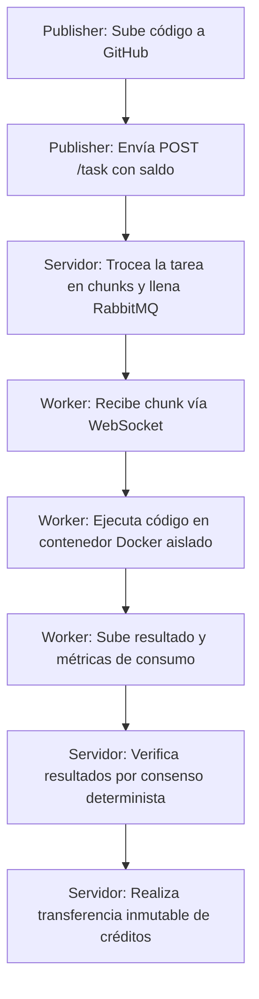

**Synergia** es una plataforma de computación distribuida voluntaria y descentralizada diseñada para democratizar el acceso a la potencia de cálculo. Permite a cualquier usuario publicar tareas computacionalmente costosas en forma de repositorios de GitHub y delegar su procesamiento a una red heterogénea de nodos voluntarios (**workers**), garantizando un entorno aislado, seguro y con verificación cruzada de resultados.

A cambio de aportar sus recursos de hardware (CPU, RAM, GPU), los workers acumulan **créditos internos** proporcionales al coste computacional real incurrido. Estos créditos se pueden utilizar posteriormente para publicar tareas propias, creando una economía circular de intercambio directo de potencia de cálculo sin necesidad de alquilar costosa infraestructura en la nube.

---

## Roles en el Sistema

El ecosistema de Synergia se define mediante la interacción de tres roles principales, que un mismo usuario puede alternar según sus necesidades:

1. **Publisher (Publicador):**
   * Es el creador o propietario de la tarea.
   * Publica la tarea en la red apuntando a un repositorio público de GitHub (`POST /task`).
   * Financia la ejecución de su tarea mediante un depósito de créditos (pagando una tasa fija de publicación `TASK_COST` y el coste del procesamiento de cada bloque).

2. **Worker (Trabajador):**
   * Es el nodo que ofrece su potencia de cómputo inactiva.
   * Se suscribe a tareas activas y consume bloques de trabajo (*chunks*) a través de un canal persistente de WebSocket.
   * Ejecuta el código de la tarea localmente dentro de un contenedor Docker estrictamente aislado.
   * Sube los resultados calculados y las métricas de consumo para recibir créditos.

3. **Servidor (Backend):**
   * Actúa como orquestador central, gestor de colas y ledger financiero.
   * Valida la integridad del código del repositorio, gestiona el flujo de mensajes en RabbitMQ y procesa las transacciones de créditos.
   * Implementa la lógica de verificación por consenso para evitar resultados fraudulentos.

---

## Organización del Proyecto

La plataforma está implementada de forma modular en dos grandes componentes independientes que residen en repositorios separados:

* **`synergia-server` (Backend):**
  * **API REST:** Escrita en FastAPI, resuelve operaciones puntuales (gestión de cuentas, login, publicación de tareas, descarga de resultados, monitorización y métricas).
  * **API WebSocket:** Servicio de alta velocidad y baja latencia para la asignación y consumo de bloques en tiempo real, conectado directamente con RabbitMQ.
  * **Base de Datos:** Oracle Database Free, utilizada para el modelado relacional completo y el libro contable criptográfico inmutable.
  * **Infraestructura de Despliegue:** Configuraciones Docker Compose, Prometheus y Grafana para monitorización operativa.

* **`synergia-client` (Cliente CLI y Worker):**
  * **CLI Tool (`synergia`):** Herramienta de línea de comandos empaquetada en Python para gestionar cuentas, configurar recursos de hardware local, publicar tareas y administrar suscripciones.
  * **Worker Interno:** Demonio que automatiza la descarga de repositorios, levantamiento de entornos aislados en Docker, ejecución de Makefile y subida de ficheros de resultado.
  * **Scheduler:** Sistema de planificación (por turnos o división de núcleos) para ejecutar múltiples tareas en segundo plano.

---

## Flujo Básico de Funcionamiento

El ciclo operativo elemental de Synergia sigue un esquema cerrado:

En las siguientes secciones se detallan los aspectos técnicos profundos de la arquitectura, la seguridad de aislamiento, el modelo económico exacto y la guía de referencia del sistema.
