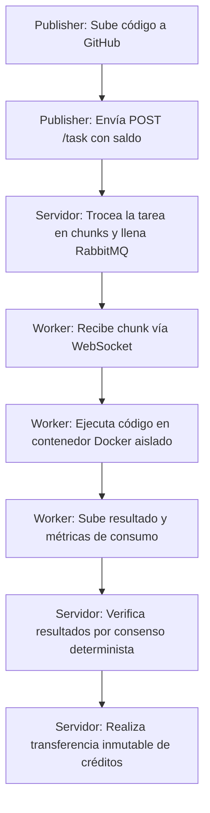

**Synergia** es una plataforma de computación distribuida voluntaria y descentralizada diseñada para democratizar el acceso a la potencia de cálculo. Permite a cualquier usuario publicar tareas computacionalmente costosas en forma de repositorios de GitHub y delegar su procesamiento a una red heterogénea de nodos voluntarios (**workers**), garantizando un entorno aislado, seguro y con verificación cruzada de resultados.

A cambio de aportar sus recursos de hardware (CPU, RAM, GPU), los workers acumulan **créditos internos** proporcionales al coste computacional real incurrido. Estos créditos se pueden utilizar posteriormente para publicar tareas propias, creando una economía circular de intercambio directo de potencia de cálculo sin necesidad de alquilar costosa infraestructura en la nube.

---

## Motivación

En estos últimos años el coste de los componentes hardware, tanto de los ordenadores personales como de los servidores dedicados, se incrementó considerablemente. Un ejemplo de esto sería el incremento del coste de las tarjetas gráficas en la época de la pandemia, debido a la escasez de chips. Otro ejemplo relevante es el encarecimiento de la memoria RAM que se observa en la actualidad, impulsado por la demanda intensiva que los sistemas de inteligencia artificial ejercen sobre este tipo de componente.

Esta situación sitúa a una gran parte de los usuarios en una posición en la que el único acceso viable de poder obtener potencia de cómputo es a través de plataformas de pago como Amazon Web Services, Microsoft Azure o Google Cloud. Sin embargo, a nivel global existe un gran número de ordenadores personales en funcionamiento, y el mercado continúa creciendo de forma sostenida.

A pesar de esto, diversos estudios indican que una parte sustancial de los recursos computacionales disponibles en los equipos personales permanece infrautilizada durante gran parte de su ciclo de vida: se ha observado que entre un 40% y un 60% de la capacidad de procesamiento está en desuso. Esta situación pone de manifiesto la existencia de una enorme cantidad de capacidad de cálculo desperdiciada.

Synergia propone una plataforma centralizada, pero distribuida, que permite que los usuarios procesen tareas publicadas a cambio de ciertos incentivos, gestionados por un sistema monetario interno que permite el intercambio de cómputo. De este modo, aquellos usuarios que carezcan de determinados componentes de hardware (como unidades de procesamiento gráfico) tienen la posibilidad de acceder a recursos computacionales especializados a cambio de contribuir con la capacidad de cómputo de la que sí disponen. Además, a diferencia de otras plataformas, esta solución no exige a los usuarios la configuración de infraestructuras propias ni el despliegue de servicios adicionales para publicar tareas, reduciendo significativamente la barrera de entrada técnica.

---

## Roles en el Sistema

El ecosistema de Synergia se define mediante la interacción de tres roles principales, que un mismo usuario puede alternar según sus necesidades:

1. **Publisher (Publicador):**
   * Es el creador o propietario de la tarea.
   * Publica la tarea en la red apuntando a un repositorio público de GitHub (`POST /task`).
   * Financia la ejecución de su tarea mediante un depósito de créditos (pagando una tasa fija de publicación `TASK_COST` y el coste del procesamiento de cada bloque).

2. **Worker (Trabajador):**
   * Es el nodo que ofrece su potencia de cómputo inactiva.
   * Se suscribe a tareas activas y consume bloques de trabajo (*chunks*) a través de un canal persistente de WebSocket.
   * Ejecuta el código de la tarea localmente dentro de un contenedor Docker estrictamente aislado.
   * Sube los resultados calculados y las métricas de consumo para recibir créditos.
   * No elige qué tarea procesar de forma arbitraria: se suscribe a tareas concretas y el sistema le asigna bloques según disponibilidad de las entradas. Por defecto, todas las cuentas están suscritas a la tarea principal del sistema; para el resto de tareas, cada vez que se ejecuta una orden de suscripción se advierte al usuario de que revise el repositorio, mostrándole el Makefile de la tarea antes de confirmar.

3. **Servidor (Backend):**
   * Actúa como orquestador central, gestor de colas y ledger financiero.
   * Valida la integridad del código del repositorio, gestiona el flujo de mensajes en RabbitMQ y procesa las transacciones de créditos.
   * Implementa la lógica de verificación por consenso para evitar resultados fraudulentos.

:::tip[¿Y si publico y proceso mi propia tarea?]
Un mismo usuario puede desempeñar los roles de publicador y worker sobre una misma tarea, procesando una tarea que él mismo creó. En ese caso se siguen generando transacciones tanto salientes como entrantes sobre la misma cuenta, dando como resultado un beneficio neto igual a cero.
:::

### Cuentas Internas del Sistema

Además de las cuentas de usuario, la plataforma mantiene un conjunto de cuentas internas utilizadas para gestionar la economía de la red. Ninguna de estas cuentas es accesible directamente por los usuarios:

| Cuenta | Función |
|---|---|
| `mint` | Emite los créditos iniciales a los nuevos usuarios que se registran en la plataforma. |
| `fees` | Recibe el coste de publicación de cada tarea y paga las recompensas a los workers que confirman resultados canónicos. |

Un ejemplo directo de su funcionamiento son los pagos de la tarea génesis del sistema (ver [Modelo Económico](/docs/modelo-economico/#el-arranque-en-frío-y-la-tarea-génesis)): en ese caso el publicador es una cuenta interna, que realiza todos los pagos y cuenta con saldo inacabable.

---

## Organización del Proyecto

La plataforma está implementada de forma modular en dos grandes componentes independientes que residen en repositorios separados:

* **`synergia-server` (Backend):**
  * **API REST:** Escrita en FastAPI, resuelve operaciones puntuales (gestión de cuentas, login, publicación de tareas, descarga de resultados, monitorización y métricas).
  * **API WebSocket:** Servicio de alta velocidad y baja latencia para la asignación y consumo de bloques en tiempo real, conectado directamente con RabbitMQ.
  * **Base de Datos:** Oracle Database Free, utilizada para el modelado relacional completo y el libro contable criptográfico inmutable.
  * **Infraestructura de Despliegue:** Configuraciones Docker Compose, Prometheus y Grafana para monitorización operativa.

* **`synergia-client` (Cliente CLI y Worker):**
  * **CLI Tool (`synergia`):** Herramienta de línea de comandos empaquetada en Python para gestionar cuentas, configurar recursos de hardware local, publicar tareas y administrar suscripciones.
  * **Worker Interno:** Demonio que automatiza la descarga de repositorios, levantamiento de entornos aislados en Docker, ejecución de Makefile y subida de ficheros de resultado.
  * **Scheduler:** Sistema de planificación (por turnos o división de núcleos) para ejecutar múltiples tareas en segundo plano.

---

## Flujo Básico de Funcionamiento

El ciclo operativo elemental de Synergia sigue un esquema cerrado:

En las siguientes secciones se detallan los aspectos técnicos profundos de la arquitectura, la seguridad de aislamiento, el modelo económico exacto y la guía de referencia del sistema.
