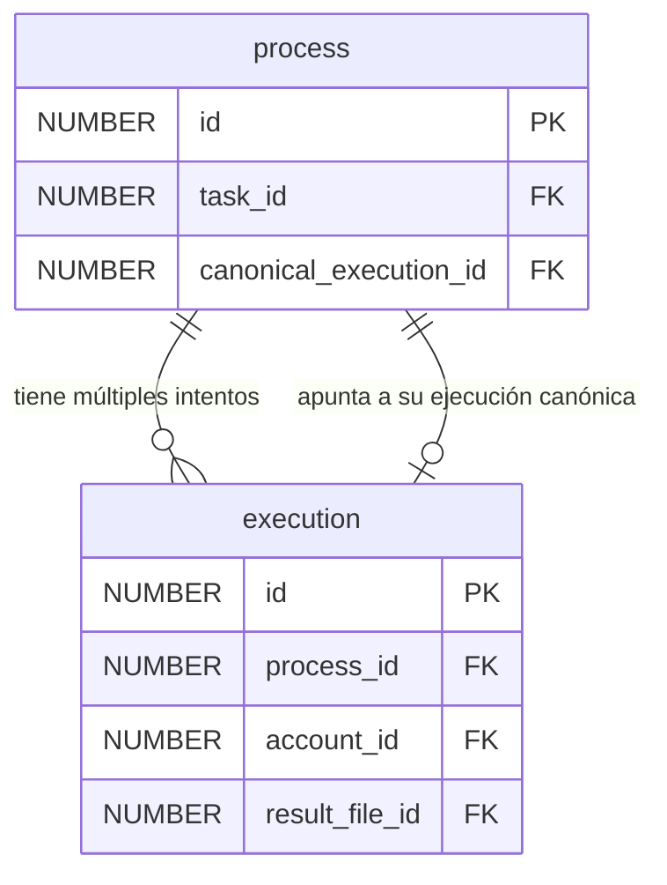

El backend de Synergia confía su persistencia a **Oracle Database Free**, modelando un esquema relacional estricto de trece tablas que garantiza consistencia ACID global y la inmutabilidad de la información económica y reputacional.

---

## Catálogo y Propósito de las Tablas

El esquema relacional de Synergia divide el dominio de negocio en cuatro subsistemas lógicos: **Cuentas y Autenticación**, **Recursos Físicos**, **Tareas y Procesamiento** e **Historial Financiero**.

| Tabla | Subsistema | Propósito y Descripción |
| :--- | :--- | :--- |
| `account` | Cuentas | Almacena el perfil del usuario (`username`, `email`, `reputation`, `balance`). Contiene cuentas reservadas del sistema: `SYSTEM_MINT` (creación inicial de créditos) y `SYSTEM_FEES` (tasas de publicación y verificación). |
| `auth_provider` | Cuentas | Catálogo fijo de proveedores de identidad autorizados (`LOCAL`, `GOOGLE`, `GITHUB`). |
| `auth_provider_account` | Cuentas | Tabla asociativa que mapea qué cuentas de `account` están enlazadas con qué proveedores de `auth_provider`, con su identificador remoto único. |
| `auth_local_credential` | Cuentas | Credenciales de login local: hash de contraseña calculado con **Argon2** y el flag binario de verificación de correo electrónico. Relación 1:1 con `account`. |
| `resource_type` | Recursos | Catálogo de tipos de recursos computacionales físicos controlados (`CPU`, `GPU`, `RAM`). |
| `resource_metric` | Recursos | Definición de las constantes físicas de tarificación de recursos (perfiles de coste por ciclo, GB o vatio). |
| `task` | Tareas | Cada tarea publicada: URL del repositorio, commit actual, snapshot de hash, estado y las telemetrías acumuladas del algoritmo incremental de Welford. |
| `resource_task` | Tareas | Mapea qué recursos (CPU, GPU o RAM) son consumidos de forma activa por una tarea. |
| `task_requirement` | Tareas | Requisitos físicos de hardware mínimos requeridos por el publicador para que un worker se suscriba (p. ej. `min_ram_mb=2048`). |
| `task_subscription` | Tareas | Relación N:M que registra qué workers están suscritos a qué tareas, junto con el contador `chunks_since_last_verification` para forzar auditorías. |
| `process` | Procesamiento | Un bloque de ejecución (*chunk*) asignado de una tarea. Contiene el rango `[input_start_index, input_end_index]` (o el valor dinámico `input_value`) y apunta a su ejecución canónica aceptada. |
| `execution` | Procesamiento | Intento o ejecución física individual realizada por un worker concreto sobre un proceso. Mantiene el estado del ciclo (`PENDING`, `SUCCESS`, `FAILED`, `CANCELLED`). |
| `result_file` | Procesamiento | Metadatos físicos del fichero binario de resultado guardado en el servidor, indexado por su hash SHA-256 para deduplicación física de archivos. |
| `transfer` | Financiero | Ledger inmutable. Registra cada movimiento de créditos entre cuentas de la red. |

---

## Diagrama Entidad-Relación

A continuación se presenta el diagrama entidad-relación global del sistema, que detalla las trece tablas del modelo de persistencia de Oracle DB y sus restricciones de integridad referencial:


---

## Claves Foráneas Circulares en el Procesamiento

Un aspecto destacado del diseño relacional del sistema es la relación bidireccional y circular establecida entre las tablas `process` y `execution`:



### Justificación de Diseño
1. Un **proceso** (chunk de trabajo) puede ser ejecutado de forma redundante por varios workers distintos para realizar la verificación cruzada. Por lo tanto, un proceso tiene una relación de **1 a N** con las **ejecuciones** (`execution.process_id` apunta a `process.id`).
2. Al mismo tiempo, tras aplicar el consenso mayoritario de hashes, el proceso debe registrar cuál de todos esos intentos fue aceptado como el resultado correcto oficial de la red. Para ello, la tabla `process` cuenta con el campo `canonical_execution_id` que apunta de vuelta a la ejecución ganadora en `execution`.

:::warning[Gestión de Transacciones]
Estas claves foráneas circulares exigen un control estricto durante la creación y borrado de registros. Al registrar la primera ejecución de un proceso nuevo, el campo `canonical_execution_id` en `process` se inicializa como `NULL`. Una vez calculado el consenso tras las subidas, el servidor realiza un `UPDATE` transaccional para enlazar el ID de la ejecución ganadora.
:::

---

## La Tabla `transfer`: Un Libro Mayor Inmutable (Blockchain Table)

La integridad económica de Synergia reside en la inmutabilidad de sus transacciones. Para evitar que un administrador malicioso con privilegios de root sobre el servidor modifique el balance de créditos de una cuenta alterando registros antiguos en SQL, la tabla `transfer` está declarada como una **Oracle Blockchain Table**.

### Sentencia SQL de Creación
La tabla se define en el motor de base de datos con restricciones criptográficas y políticas de retención activas a nivel de kernel:

```sql
CREATE BLOCKCHAIN TABLE transfer (
    id NUMBER(19) NOT NULL,
    from_account_id NUMBER(19) NOT NULL,
    to_account_id   NUMBER(19) NOT NULL,
    task_id NUMBER(19), 
    process_id NUMBER(19),
    amount NUMBER(20,4) NOT NULL,
    created_at TIMESTAMP DEFAULT CURRENT_TIMESTAMP NOT NULL,
    CONSTRAINT pk_transfer PRIMARY KEY (id)
)
NO DROP UNTIL 31 DAYS IDLE
NO DELETE LOCKED
HASHING USING "SHA2_512" VERSION "v1";
```

### Propiedades de Seguridad de las Blockchain Tables

1. **Inmutabilidad de Filas (`NO DELETE LOCKED`):** Ninguna fila insertada en la tabla `transfer` puede ser eliminada jamás por ninguna sentencia `DELETE` o `TRUNCATE`, ni siquiera por el usuario administrador de la base de datos (`SYS`/`SYSTEM`).
2. **Protección de la Estructura (`NO DROP UNTIL 31 DAYS IDLE`):** Impide eliminar o realizar un `DROP` de la tabla completa a menos que la base de datos detecte que la plataforma ha permanecido inactiva (sin inserciones nuevas) durante un período mínimo de 31 días.
3. **Encadenamiento Criptográfico (`HASHING USING "SHA2_512"`):** Cada vez que se añade una transferencia de créditos (p. ej. el pago de una tarea), la base de datos calcula automáticamente un hash **SHA2-512** que concatena el contenido de los campos de la nueva fila con el hash de la fila anterior. Si alguien intentara modificar un byte en el almacenamiento físico del disco duro, la firma en cadena se rompería instantáneamente, invalidando el libro contable.

### Impacto en la API REST (Prohibición de `FOR UPDATE`)
Dado que las Blockchain Tables implementan un modelo de solo inserción (*insert-only*) strictly consistente, **no admiten bloqueos de fila mutacionales**. 

Por este motivo, las consultas en la API REST de Synergia que leen la tabla `transfer` para calcular balances o transacciones **nunca utilizan la directiva SQL `FOR UPDATE`**. Intentar ejecutar un bloqueo mutacional sobre registros criptográficos inmutables provocaría un error explícito de rechazo por parte del motor de Oracle. El control de concurrencia se resuelve elevando el aislamiento transaccional del backend a **SERIALIZABLE**.
