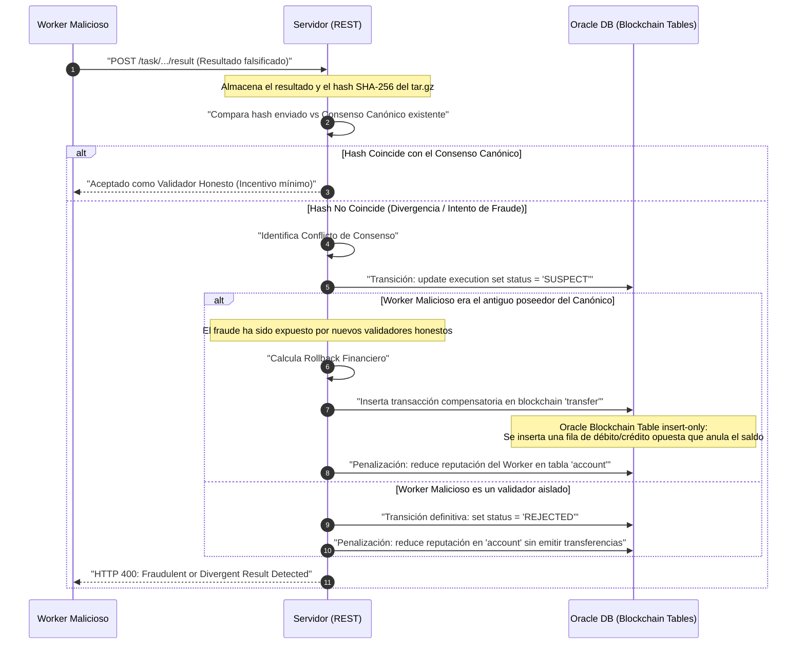

La seguridad en Synergia se gestiona bajo el principio de mínimos privilegios y de "confianza cero" hacia el código arbitrario descargado de los repositorios de las tareas. Este principio se aplica tanto en la validación de identidad en el servidor como en el aislamiento del entorno físico en el worker.

---

## Autenticación de Cuentas

La plataforma admite dos formas independientes de autenticación y registro que se resuelven en la base de datos Oracle:

### Autenticación Local
* **Hasheo robusto (Argon2id):** Las contraseñas locales nunca se guardan en texto plano ni bajo algoritmos débiles o reversibles. Se procesan utilizando **Argon2id** (vía `argon2-cffi`), el algoritmo ganador del *Password Hashing Competition (PHC)*, inmune a ataques de GPU masivos gracias a su configuración de consumo intensivo de memoria.
* **Verificación obligatoria de email:** El registro de cuentas locales exige verificar el correo electrónico del usuario. El servidor genera un token JWT firmado de un único propósito (`purpose: email_verification`) y lo envía mediante un servidor **SMTP**. El endpoint `/verify-email` valida el token y activa el flag en base de datos.
* **Restricción de dominio de correo:** Para mitigar la creación automatizada de cuentas falsas y fraudes de reputación (*Sybil attacks*), la API REST valida que el correo pertenezca a una lista blanca de dominios permitidos (por defecto: `gmail.com`, `outlook.com`, `hotmail.com` y `udc.es`).

### Autenticación OAuth 2.0 (Google y GitHub)
Permite el registro e inicio de sesión rápido sin contraseña local:
* **Flujo seguro (Authorization Code Flow):** El cliente solicita la URL de autorización al servidor, el cual genera un parámetro aleatorio de seguridad `state` contra ataques CSRF. Este `state` se guarda en una caché de memoria del servidor con un tiempo de vida (TTL) estricto de 5 minutos y se valida al recibir el callback.
* **Doble petición en GitHub:** El callback de Google intercambia el código directamente por el token y lee el email. El callback de GitHub contempla la privacidad del usuario: si el correo público no está disponible en la primera respuesta del proveedor, realiza una segunda llamada autenticada y cifrada al endpoint `/user/emails` de la API de GitHub para recuperar el correo privado verificado.
* **Cuentas Multiproveedor:** El modelo relacional permite asociar múltiples credenciales de OAuth (p. ej. registrarse con Google y posteriormente vincular la cuenta de GitHub) a un único identificador de `account`.

---

## Gestión de Sesión y JSON Web Tokens (JWT)

Una vez que el usuario se autentica con éxito (local o vía OAuth), el servidor expide un **JSON Web Token (JWT)** que actúa como credencial de sesión:

* **Firma digital (HS256):** El token está firmado digitalmente con el algoritmo simétrico HMAC SHA-256 utilizando la clave secreta `JWT_SECRET_KEY` configurada en el servidor.
* **Cabecera personalizada (`token`):** A diferencia del estándar industrial habitual que emplea el formato `Authorization: Bearer <JWT>`, la API REST de Synergia exige de forma deliberada el envío del token en una cabecera personalizada denominada `token` (`token: <JWT_VALUE>`).
* **Expiración de 24 Horas:** La validez de la sesión es de exactamente 24 horas. Expirado este plazo, el cliente CLI denegará las peticiones locales obligando a un nuevo inicio de sesión (`synergia login-user`).
* **Identificación del sujeto:** El payload del token contiene el ID numérico único de la cuenta en el campo `sub`, impidiendo la suplantación de identidad entre usuarios.

---

## Integridad y Seguridad en el Cómputo (Resumen)

Para obtener una descripción profunda sobre las políticas de seguridad en la ejecución, consulta la guía dedicada de [Internals del Worker y Aislamiento](/docs/worker-aislamiento). Las defensas clave implementadas son:

* **Aislamiento Docker:** Todo código de terceros se ejecuta bajo un usuario sin privilegios de administración (`worker`) y con límites de RAM/CPU por cgroups.
* **Cortafuegos iptables:** Se bloquea toda comunicación de red saliente dentro del contenedor por defecto. Solo se añaden excepciones para resoluciones DNS y para las direcciones IP resueltas asociadas a los dominios autorizados de la lista `[network].allowed_hosts`.
* **Wrappers de Descarga Segura:** Los binarios de descarga nativos (`curl`/`wget`) están reemplazados por ejecutables en C con bit setuid que registran en un log de solo lectura el hash SHA-256 de cada descarga.
* **Snapshot de Repositorio:** El worker echa un vistazo de integridad comparando el hash combinado del código y sus dependencias descargadas contra el snapshot original registrado por el servidor en la base de datos al publicar la tarea. Si los hashes difieren, la ejecución se cancela automáticamente.

---

## Escenarios Operativos y Validación Técnica

Para certificar la invulnerabilidad del orquestador de Synergia en entornos hostiles reales, se definen dos escenarios operativos avanzados que regulan el comportamiento ante fraudes y fallos físicos.

### Escenario C.3: Detección y Mitigación de Fraude en Tareas Deterministas

Cuando un voluntario malicioso altera intencionadamente el código local de la tarea o altera el binario de salida para enviar resultados falsos o manipulados a cambio de créditos fáciles, el orquestador aplica una mititgación criptográfica automática.



#### Transiciones de Base de Datos y Logs
1. **POST de Subida de Resultados:** Al procesar un POST a `/task/{id}/process/{pid}/execution/{eid}/result`, el servidor guarda la telemetría e inserta el hash SHA-256 del fichero de salida subido por el worker.
2. **Evaluación de Consenso:** La base de datos ejecuta una consulta para determinar el número de ejecuciones idénticas para cada hash de salida. Si la ejecución del worker actual arroja un hash que no coincide con el canónico establecido, se marca provisionalmente el estado de su ejecución en la tabla `execution` como `'SUSPECT'`.

#### Rollback Financiero en Tablas Blockchain
Dado que el ledger financiero de Synergia utiliza **Oracle Blockchain Tables** (tablas inmutables diseñadas bajo un esquema *insert-only* que prohíbe de forma física el uso de cláusulas `UPDATE`, `DELETE` o bloqueos de fila mutacionales como `FOR UPDATE`), es imposible borrar o modificar directamente un registro de cobro que haya resultado ser fraudulento.

Para anular el fraude y corregir el saldo, el orquestador aplica una **transacción de compensación**:
1. Identifica el ID de la transacción original (`transfer_id`) mediante la cual el worker malicioso cobró fraudulentamente los créditos.
2. Inserta una nueva fila en la tabla blockchain de transferencias (`transfer`) con signo opuesto:
   * **Origen:** La cuenta del worker malicioso (`account_id` del estafador).
   * **Destino:** La cuenta del Publisher de la tarea (`account_id` original).
   * **Cantidad:** La totalidad de los créditos pagados previamente por ese bloque.
3. El motor criptográfico de la tabla blockchain genera de forma secuencial una firma hash SHA-256 encadenada que sella la transacción compensatoria, garantizando que el historial de auditoría de fraude sea imborrable para inspectores de seguridad.

#### Penalizaciones de Reputación
Se actualiza la tabla de cuentas (`account`) reduciendo la reputación del worker estafador en un factor multiplicativo del **50%**. Si la reputación acumulada desciende por debajo de un umbral del **20%**, la cuenta se marca en estado `'BANNED'` de forma persistente y el orquestador deniega cualquier petición futura de WebSocket.

---

### Escenario C.4: Tolerancia a Fallos y Caídas Abruptas de Conexión

Este escenario gestiona la desconexión física de un nodo (un apagón del hardware del voluntario, pérdida repentina de cobertura de red o detención manual del servicio por el usuario) en mitad del procesamiento de un bloque.

```mermaid
sequenceDiagram
    autonumber
    participant W as Worker (Cliente)
    participant S as Servidor (WS / REST)
    participant Q as RabbitMQ (Colas)
    participant DB as Oracle DB

    Note over W: Procesando tarea activa (make run)
    Note over W,S: Conexión persistente WebSocket activa
    W-xS: "Desconexión abrupta de red (Pérdida de Heartbeat)"
    
    Note over S: El servidor detecta cierre de socket (TCP FIN o Timeout)
    S->>S: "Identifica IDs de ejecuciones asignadas al Socket caído"
    
    S->>Q: "Devuelve el chunk: aio-pika amqp_message.nack(requeue=True)"
    Note over Q: El chunk vuelve al inicio de la cola de RabbitMQ
    
    S->>DB: "Actualiza ejecuciones asociadas a status = 'LOST'"
    
    rect rgb(30, 30, 40)
        Note over W: El host se recupera (reinicio físico)
        W->>W: "Ejecuta rutina de inicialización de huérfanos"
        W->>W: "docker kill y docker rm de contenedores huérfanos synergia-*"
        W->>W: "Elimina outputs parciales corruptos"
    end
```



#### Mecanismos de Red y Ciclo de Vida de RabbitMQ
1. **Detección de Caída:** La conexión WebSocket mantiene un flujo de monitorización cruzada (*heartbeat* o ping/pong cada 10 segundos). Si el servidor no recibe actividad tras 20 segundos, asume la caída física del nodo y cierra el socket a nivel TCP.
2. **Re-encolado en RabbitMQ (Garantía At-Least-Once):**
   * El orquestador localiza el objeto de mensaje AMQP que había sido entregado de forma provisional al worker caído (el cual permanecía en estado *unacknowledged*).
   * Utilizando la librería asíncrona de comunicación `aio-pika`, el servidor realiza una llamada a `message.nack(requeue=True)`.
   * El mensaje del chunk se reincorpora de manera inmediata a la cabeza de la cola de RabbitMQ para ser asignado de forma instantánea al siguiente worker libre de la red, evitando retrasos en el pipeline global de la tarea.
3. **Actualización de Estados:** El backend actualiza los registros afectados de la tabla `execution` de la base de datos de `'RUNNING'` a `'LOST'`.

#### Reconciliación de Procesos Huérfanos en el Worker
Cuando la máquina host del voluntario recupera el suministro eléctrico o la conectividad de red, el demonio local del worker se arranca de manera automatizada como un servicio de `systemd`. 

Durante su inicialización de arranque (antes de conectar con el orquestador):
1. **Limpieza del Espacio de Nombres de Docker:** El script de inicialización ejecuta una inspección en busca de contenedores Docker con el prefijo de nomenclatura del sistema:
   ```bash
   docker ps -a --filter "name=synergia-*" --format '{{.ID}}' | xargs -r docker rm -f
   ```
   Esto elimina de forma limpia cualquier contenedor huérfano que hubiera quedado congelado o consumiendo RAM/GPU.
2. **Purga de Salidas Corruptas:** Se eliminan de manera local las carpetas de salida temporales `/outputs` y archivos de dependencias descargadas a medio escribir para evitar colisiones de hashes o subidas corruptas en futuras ejecuciones.
3. **Reconexión Segura:** El cliente local CLI realiza un nuevo handshake de WebSocket seguro para solicitar un bloque de trabajo fresco de la red.
